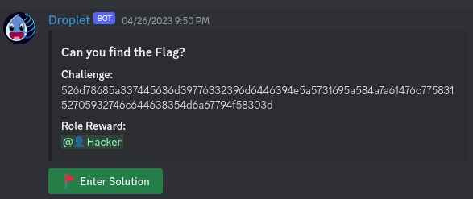
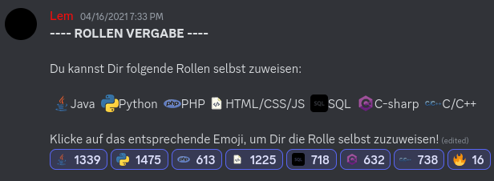
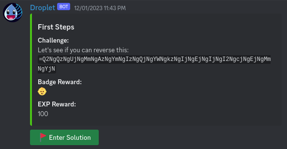
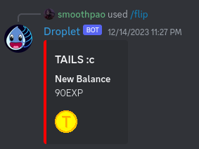
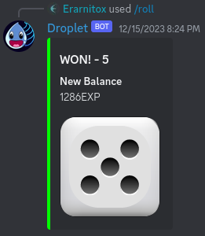
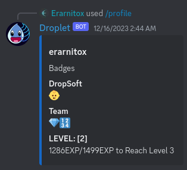

# Droplet - Discord Bot
---
</img>

Droplet is a feature-rich Discord bot written in modern C++ to enhance your discord server's experience. 

It offers a wide range of functionalities and commands to engage with your community, moderate, entertain users.
With its sleek design and powerful capabilities, Droplet is the perfect companion for managing your Discord server.

<p align="center">
    <a href="https://discord.com/api/oauth2/authorize?client_id=1071149612305498162&permissions=2215135296&scope=bot">Invite to Server</a>
    |
    <a href="https://top.gg/bot/1071149612305498162">Top.gg</a>
    |
    <a href="https://droplet.erarnitox.de">Website</a>
</p>

---

## Features

- **Challenge Roles:** Create CTF-Style Challenges and reward solvers with roles.
- **Reaction Roles:** Let Members choose their own roles by reacting to a configurable message.
- **CTF-Challenges:** Create CTF-Style Challenges. Reward solvers with badges and exp.
- **Youtube Feed:** Get Updated about any recent youtube uploads of youtube channels you fancy!
- **Flip a Coin:** Flip a coin and gamble some exp.
- **Greetings:** Joining and Leaving members will be announced by the bot in a configurable channel.
- **Roll a Dice:** Roll a dice and gamble some exp.
- **Server Insights:** Get a quick overview of your server.
- **Manage Resources:** Manage shared links using the bot, so they are kept nicely ordered and won't be lost.
- ***MORE!!:*** Features are *constantly* **added** and get **updated** use the **`/help`** command to get a list of all commands that are available to you.

---

## Installation

#### Clone the repository:

```shell
git clone https://github.com/Erarnitox/Droplet
```

#### Compile the source code:

```shell

cd Droplet
cmake --preset release && cmake --build release
```

#### Configure the bot:

The bot expects 2 files to be placed next to the binary:
- **bot_token.txt** : holds the bot token in plan text
- **db_connection.txt** : holds the connection string for your postgres database

##### Certificates
To enable the REST Server SSL Certificates are expected in the directory of the bot binary.
You can use certbot to create these certificates for you and then create symlinks like this:

```
ln -s /etc/letsencrypt/live/<your_domain>/fullchain.pem server.crt
ln -s /etc/letsencrypt/live/<your_domain>/privkey.pem server.key
```

**Note:** for debug builds self signed certificates are created automatically


#### Run the bot:

```shell
./droplet
```

---

## Contributing

If you have suggestions, bug reports, or feature requests, please open an issue or submit a pull request to this repository.
Before contributing, please review the Contributing Guidelines.

### Crontributing Guidelines
- Your Code must adhere to our [Styleguide](./docs/styleguide.md)
- Before creating a pull request please check off this [Checklist](./docs/checklist.md)

---

## License

[MIT License](./LICENSE)

## Architecture
### Architecture Document


The goal with this design was that we have a stable and solid core that offers commands a stable API they can use. Additional commands should only be reigistered with the `Commands` class and don't need to worry about anything else.

The bot library can be linked against the `main` executalbe that will only call the start function in the bot library or against the `unit_test` executable. The goal here was to make the code more testable by giving the `unit_test` executable a better insight into the bot library, than what would be possible by having the bot functionality directly in the `main` executable.

### Current Dependency Graph


## Documentation
[Visit Documentation](https://droplet.erarnitox.de/doxygen/html/)

---

## Contact

For questions, feedback, or support, please contact the project maintainer:

- **Discord:** @erarnitox
- **Email:** david@erarnitox.de

You can also join my discord server below

[](https://discord.erarnitox.de)

---

## Screenshots

#### Configurable Challenge Roles:


#### Configurable Reaction Roles:


#### Configurable CTF-Challenges:


#### Coin Flip Gambling:


#### Dice Roll Gambling:


#### Profile information:

