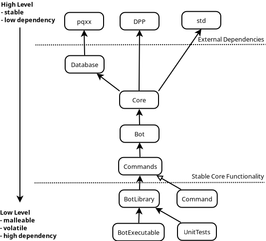

> [!WARNING]
> This repository is in an early WIP state! Don't expect everything to work yet!

> [!WARNING]
> Everything in this repository unstable and due to change in the future!

# Droplet - Discord Bot
---
</img>

Droplet is a feature-rich Discord bot written in modern C++ to enhance your discord server's experience. 

It offers a wide range of functionalities and commands to engage with your community, moderate discussions, entertain users, and automate various tasks. With its sleek design and powerful capabilities, Droplet is the perfect companion for managing your Discord server.


---

## Features

- **Moderation:** Maintain a healthy environment by managing users, roles, enforcing rules, and moderating discussions.
- **Utility:** Perform various utility functions like cross posting to linked social media profiles.
- **Fun:** Entertain your community with a range of fun commands, including games, lottery and gambling that are all linked to the bots token economy.
- **Customization:** Tailor Droplet to your server's needs with customizable settings.
- **Automation:** Automate repetitive tasks with scheduled messages, reminders, and event notifications.
- ***MORE!!:*** Features are *constantly* **added** and get **updated** use the **`/help`** command to get a list of all commands that are available to you.

---

## Installation

#### Clone the repository:

```shell
git clone https://github.com/Erarnitox/Droplet
```

#### Compile the source code:

```shell

cd Droplet
cmake --preset release && cmake --build release
```

#### Configure the bot:

The bot expects 2 files to be placed next to the binary:
- **bot_token.txt** : holds the bot token in plan text
- **db_connection.txt** : holds the connection string for your postgres database


#### Run the bot:

```shell
./droplet
```

---

## Contributing

If you have suggestions, bug reports, or feature requests, please open an issue or submit a pull request to this repository.
Before contributing, please review the Contributing Guidelines.

### Crontributing Guidelines
- Your Code must adhere to out [Styleguide](./docs/styleguide.md)
- Before creating a pull request please check off this [Checklist](./docs/checklist.md)

---

## License

[MIT License](./LICENSE)

## Architecture
### Goal Architecure Sketch


### Current Dependency Graph


## Documentation
[Visit Documentation](https://droplet.erarnitox.de/doxygen/html/)

---

## Contact

For questions, feedback, or support, please contact the project maintainer:

- **Discord:** @erarnitox
- **Email:** david@erarnitox.de

You can also join my discord server below

[](https://discord.dropsoft.org)

---

## Screenshots

#### Configurable Challenge Roles:


---

## Roadmap
[Github Project](https://github.com/users/Erarnitox/projects/1/views/1)

### Business Plan
To get an idea of where we want to go with this project take a look at the [Business Plan](./docs/business_plan.md)