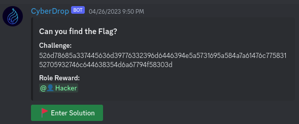

# CyberDrop - Discord Bot
---
</img>

CyberDrop is a feature-rich Discord bot written in modern C++ to enhance your server's experience. 

It offers a wide range of functionalities and commands to engage with your community, moderate discussions, entertain users, and automate various tasks. With its sleek design and powerful capabilities, CyberDrop is the perfect companion for managing your Discord server.


---

## Features

- **Moderation:** Maintain a healthy environment by managing users, roles, enforcing rules, and moderating discussions.
- **Utility:** Perform various utility functions like cross posting to linked social media profiles.
- **Fun:** Entertain your community with a range of fun commands, including games, lottery and gambling that are all linked to the bots token economy.
- **Customization:** Tailor CyberDrop to your server's needs with customizable settings.
- **Automation:** Automate repetitive tasks with scheduled messages, reminders, and event notifications.
- ***MORE!!:*** Features are *constantly* **added** and get **updated** use the **`/help`** command to get a list of all commands that are available to you.

---

## Installation

#### Clone the repository:

```shell
git clone https://github.com/Erarnitox/CyberDrop
```

#### Compile the source code:

```shell

cd CyberDrop
cmake --preset release && cmake --build release
```

#### Configure the bot:

The bot expects 2 files to be placed next to the binary:
- **bot_token.txt** : holds the bot token in plan text
- **db_connection.txt** : holds the connection string for your postgres database


#### Run the bot:

```shell
./cyber_drop
```

---

## Contributing

Contributions are welcome! If you have suggestions, bug reports, or feature requests, please open an issue or submit a pull request to this repository.

Before contributing, please review the Contributing Guidelines.

---

## License

This project is licensed under the [Drop License](https://github.com/DropSoftCommunity/DropKit/blob/main/LICENSE/DROP_LICENSE.TXT).

---

## Contact

For questions, feedback, or support, please contact the project maintainer:

- **Discord:** @erarnitox
- **Email:** david@erarnitox.de

---

## Screenshots

#### Configurable Challenge Roles:


---

## Roadmap
[Github Project](https://github.com/users/Erarnitox/projects/1/views/1)